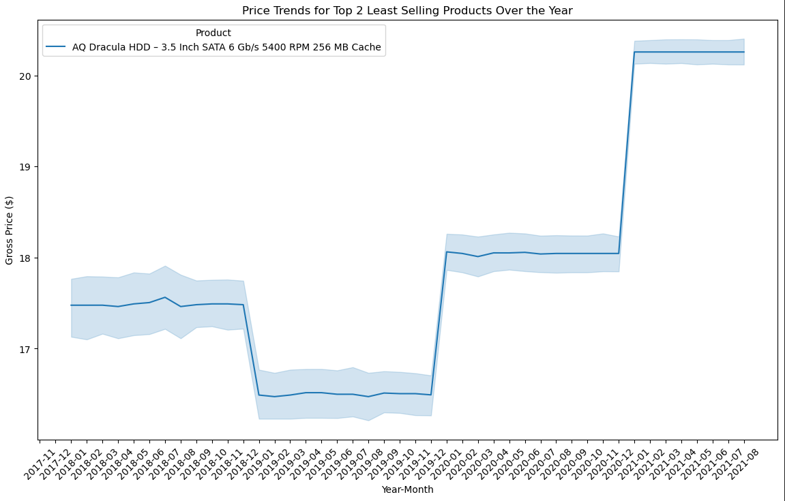
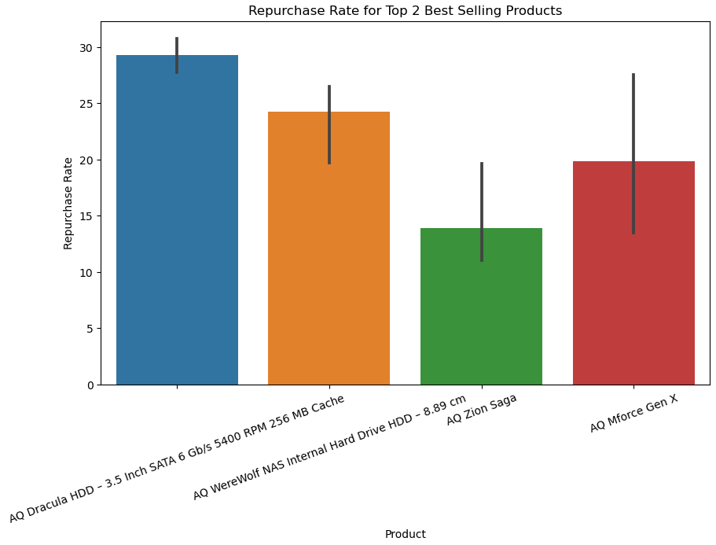
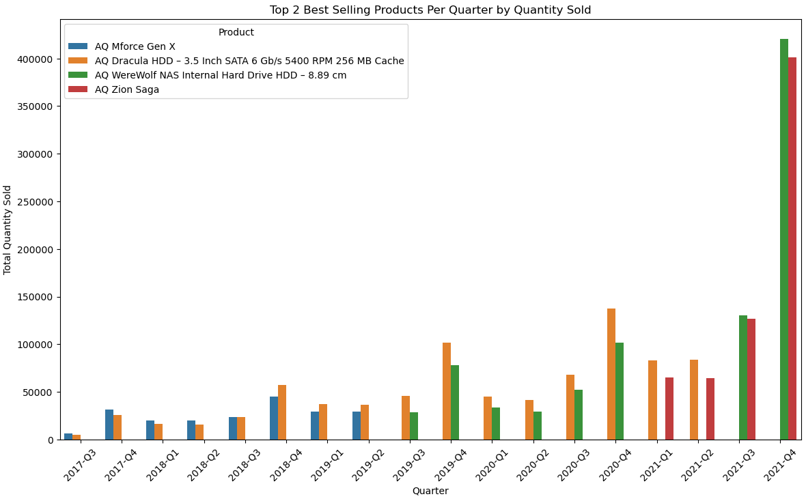
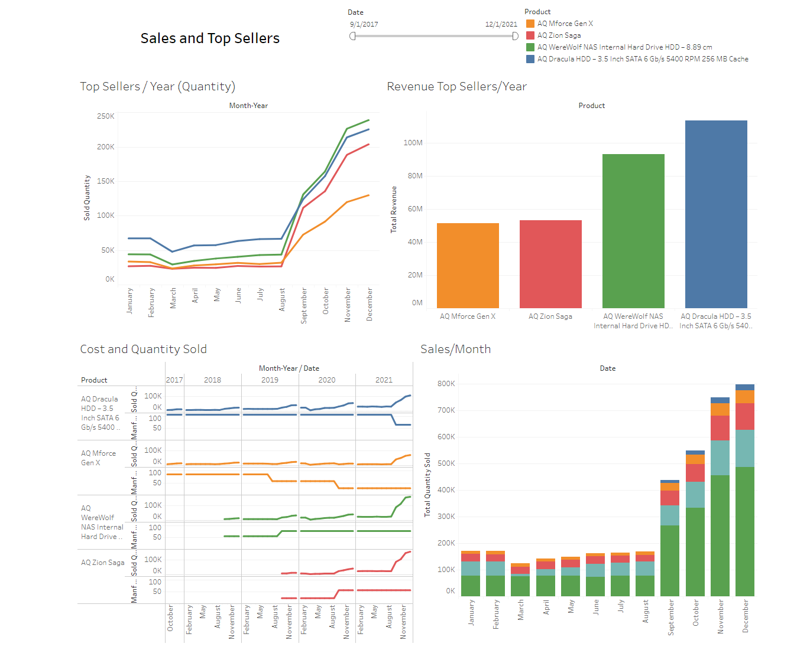

# AtilQ

## Overview
- Find the best way to create a higher revenue for AtilQ

# Graph / Tableua
[Dashboard](https://public.tableau.com/views/FinalProject_17208106928160/Dashboard1?:language=en-US&:sid=&:redirect=auth&:display_count=n&:origin=viz_share_link)

## What is the reason for the project
- Find the best selling products for the month in quantity to know what products to advertise more
- Repurchase rate of the best selling products
- Price trends for a product which correlates to the best time to sell

## Images

### Technologies
- This was written using Jupyternotebook, Visual Code and visualized using tableau.
